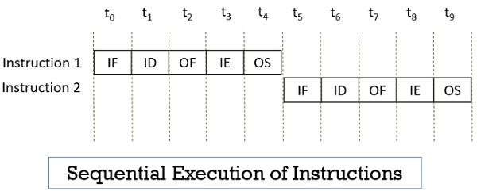
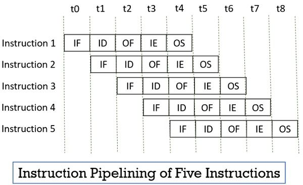

# Review
## Know the Concepts
* Describe the fetch-execute cycle.

	The fetch-execute cycle is the process by which the CPU reads in
	instructions from memory one at a time and executes them.

* What is a register? How would computation be more difficult without
  registers?
  
    Registers are special, high-speed memory locations that a processor
    has. It would be difficult for computation without registers as
    general-purpose registers are generally used for operations like addition,
    subtraction, multiplication, comparisons and other operations.

* How do you represent numbers larger than 255?

	Numbers larger than 255 can be represented by a combination of bytes.
	
* How big are the registers on the machines we will be using?

	On x86_64, the registers can be 8-bit, 16-bit, 32-bit, and 64-bit.
	
* How does a computer know how to interpret a given byte or set of bytes of
  memory?
  
    A computer does not know how to interpret a given byte on its own. The
	programmer has to specify instructions on how memory is to be interpreted
	to the computer.

* What are the addressing modes and what are they used for?

	Addressing modes are different ways of instructing the processor to
    access data.
	
	+ Immediate mode

		`mov $1, %eax`

		Immediate mode embeds the data to be accessed within the instruction
        itself.
		
	+ Register addressing mode
	
		`mov %ebx, %eax`
		
		Register addressing mode specifies a register to access.

	+ Direct addressing mode
	
		`mov ADDRESS, %eax`
		
		In direct addressing mode, the instruction contains the memory address
        to access.

	+ Indexed addressing mode
	
		`mov ADDRESS(,%ecx,1), %eax`
		
		In indexed addressing mode, the instruction contains a memory address
		to access and specifies an index register to offset the address.
		
	+ Indirect addressing mode
	
		`mov (%eax), %ebx`
		
		In indirect addressing mode, the instruction contains a register that
		contains a pointer to where the data should be accessed.
		
	+ Base pointer addressing mode
	
		`mov 8(%eax), %ebx`
		
		Base pointer addressing mode is similar to indirect addressing in that
		the instruction uses a register that contains a pointer but also
		includes an offset to add to the register's value before using it to
		access data.

* What does the instruction pointer do?

	The instruction pointer holds the address of the next instruction to
    execute.

## Use the Concepts

* What data would you use in an employee record? How would you lay it out in
  memory?

		Start of record:
			Employee name pointer (1 word) - start
			Employee address pointer (1 word) - start + 8
			Employee age (1 word) - start + 16
			Employee id (1 word) - start + 24

* If I had the pointer at the beginning of the employee record above, and
  wanted to access a particular piece of data inside of it, what addressing
  mode would I use?
  
    You would use the indexed addressing mode with a multiplier of 8 as it
	would allow for easy sequential access to each memory segment as the index
	register is incremented.

* In base pointer addressing mode, if you have a register holding the value
  3122 and an offset of 20, what address would you be trying to access?

	3122+20 = 3142
	

* In indexed addressing mode, if the base address is 6512, the index register
  has a 5, and the multiplier is 4, what address would you be trying to
  access?
  
    6512+5*4 = 6532

* In indexed addressing mode, if the base address is 123472, the index
  register has a 0, and the multiplier is 4, what address would you be trying
  to access?
  
    123472+0*4 = 123472
	
* In indexed addressing mode, if the base address is 9123478, the index
  register has a 20, and the multiplier is 1, what address would you be trying
  to access?
  
    9123478+20*1 = 9123498
	
## Going Further

* What are the minimum number of addressing modes needed for computation?

	You would need a minimum of 1 addressing mode, namely indirect addressing
	mode, to access data in memory needed for computation.
	
* Why include addressing modes that aren't strictly needed?

	Although all other addressing modes apart from indirect addressing mode
	are not strictly needed and have their functionality replaced by loops or
	manual computation, they provide much convenience for the programmer. For
	example, immediate mode saves the use of a register if all we want is to
	access a static variable. Base pointer addressing mode removes the need
	for extra instructions to manually compute the offset.
	
* Research and then describe how pipelining (or one of the other complicating
  factors) affects the fetch-execute cycle.
  
    
	
    In a normal fetch-execute cycle, the processor processes each instruction
	in a sequential manner by first fetching an instruction from memory,
	performing the required operation, and finally storing the result of the
	operation to the specified memory location. The instruction execution
	process can be divided into more specialized stages such as **instruction
	fetches**, **instruction decoding**, **operand fetching**, **instruction
	execution**, and **operand storage**.
	
	
	
	Pipelining is a technique developed to increase the throughput of the
	normal fetch-execute cycle. By assigning each stage of the instruction
	execution process to a different section of hardware to be processed, we
	can allow the execution of multiple instructions to be overlapped, much
	like an industrial assembly pipeline. This produces a noticeable speed up
	in processing time as instruction execution throughput is increased.
	
* Research and then describe the trade-offs between fixed-length instructions
  and variable-length instructions.

	+ Fixed-length instructions (RISC Processors)
	
		In RISC processors, the uniform format of the simpler instruction set
        makes it trivial for instructions to be parsed into their components,
        allowing for faster instruction fetches and decoding. This also means
        that less power is consumed by RISC processors. Conversely,
        fixed-length instructions make using large operands more difficult as
        they have to be loaded as data, which incurs the overhead of an extra
        load instruction.
		
	+ Variable-length instructions (CISC Processors)
	
		The trade-offs of CISC processors are essentially the reverse of RISC
		processors. Variable-length instructions allow for greater code
		density and large constants can be used without any overhead. However,
		variable-length encoding makes it more difficult to parse and find the
		start of the next sequential instruction.
